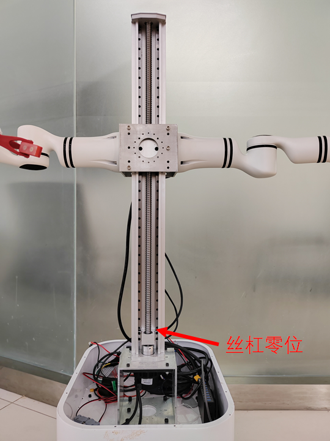

# Adora A2 Pro 丝杠节点

注意：电机第一次使用的时候一定要先发送0位置！！！看是否到达了离底盘最近的地方，如下图中标记的零点位置。

## 1. Python节点测试

直接运行以下命令，丝杆会以20秒为周期，在0-200mm的行程往复运动

```
sudo chmod 777 /dev/ttyACM0
python SerialLiftingMotor.py
```

该SerialLiftingMotor.py文件通过函数cmd_vel_callback(self, uint32_msg)发送丝杆升高的距离，并通过函数run(self) 读取丝杆的位置，将数据存放在类变量 self.motor_positon_read 中，类参数self.motor_positon_read表示丝杆当前相对于零位的高度，单位(mm)。


## 2. Dora 节点

driver_dora.yaml 存放了丝杠的测试yaml文件，该文件描述了两个dora节点，节点A以10S的间隔时间发送位置0 和 位置（单位 mm） 测试丝杠电机的行程。

启动方法

```
dora up
dora start driver_dora.yaml --name test_motor
```

此时 丝杠会周期性的上下运动


## 3 备注

注意：电机第一次使用的时候一定要先发送0位置，看是否到达了离底盘最近的地方，如下图中标记的零点位置。

丝杠电机供电电压为24V，丝杠的零位位于靠近电机侧位置，如下图所示


