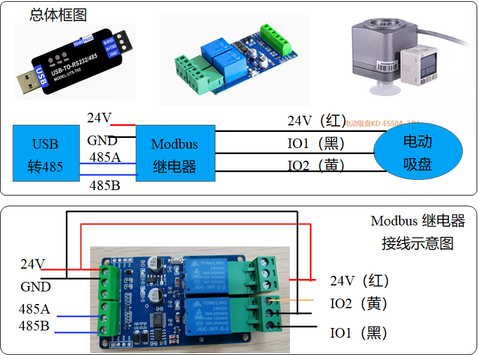
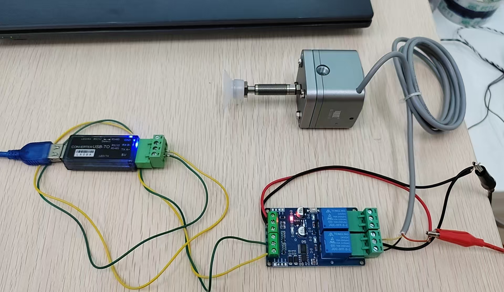
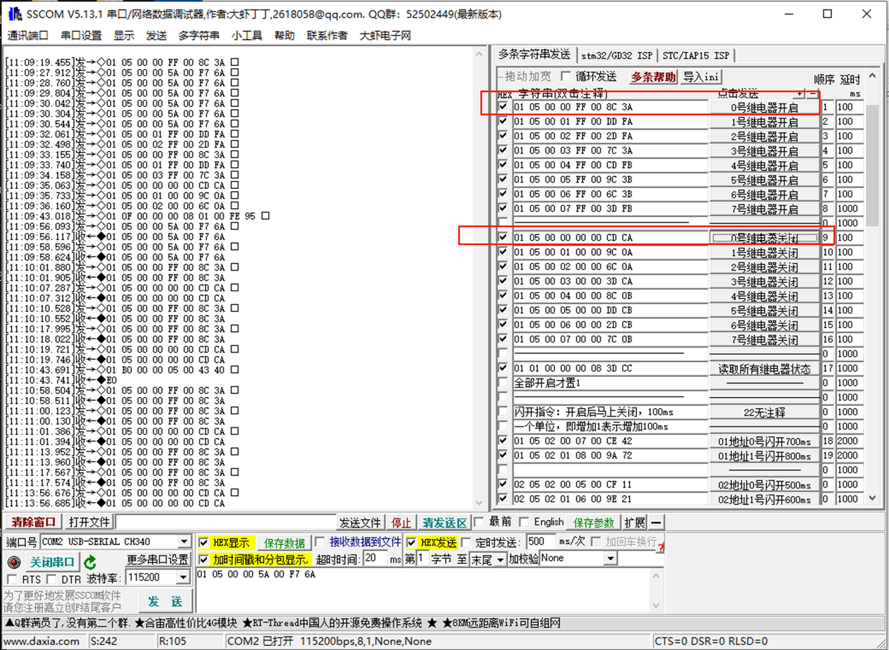

# 电动吸盘节点

该电动吸盘（选用电动吸盘 KD-ES50A-24V）通过一个modbus继电器模块进行控制，电脑或其他控制单元通过USB转串口设备向继电器发送指令，实现电动吸盘控制。该modbus继电器具有状态保持功能，即电脑向继电器发送继电器ON指令以后，继电器会持续保持ON指令，待到接收到新指令以后再改变继电器工作状态。



继电器与吸盘连线示意图(鳄鱼夹端红色线位电源24V，黑色为电源负)

吸盘红色线：接电源24V

吸盘黄色线：接继电器NC0

吸盘黑色线：接继电器NO0




## 1 继电器配置

该继电器模块默认通讯波特率为9600，建议修改为19200，可通过资料包中的串口助手进行修改波特率或者测试继电器。



## 2. Python节点测试

 启动文件夹下的python文件，继电器0通道会打开，持续2秒后，0通道关闭，以此反复运行

```
sudo chmod 777 /dev/ttyUSB0
python SuctionPumpController.py
```


## 3. Dora 节点运行

**suction_pump_driver_dora.yaml** ，该文件描述了两个dora节点，节点A以2S的间隔时间发送打开和关闭指令

启动方法

```
dora up
dora start suction_pump_driver_dora.yaml --name test_motor
```

此时  继电器0通道会打开，持续2秒后，0通道关闭，以此反复运行。

注：节点A发送的数据包含两个字段，第一个数据表示通道，第二个数据表示继电器开/关（0：继电器关，1：继电器开）

- **发送节点部分代码：**

```
value = 0
ch = 0
send_output(
            "cmd_ch_state",
            pa.array([ch,value]),
            dora_input["metadata"],
        )
```

- **接收节点处理代码：**

```
 if "cmd_ch_state" == dora_input["id"]:
            cmd_ch = dora_input["value"][0].as_py() # 通道
            cmd_value = dora_input["value"][1].as_py() # 大于1打开继电器   0关闭
            if cmd_value >= 1:
                self.app.open_channel(int(cmd_ch))
            else:
                self.app.close_channel(int(cmd_ch))
```

