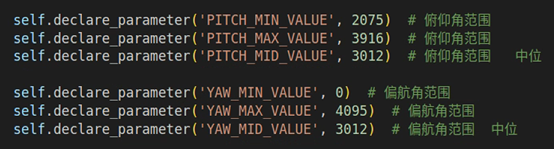
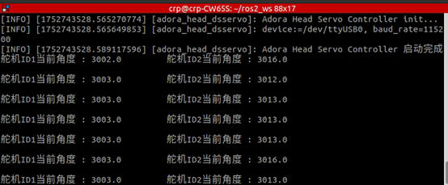
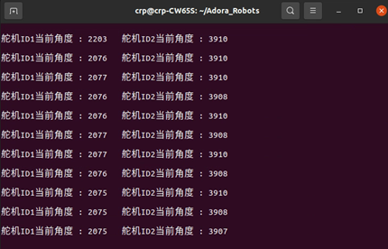
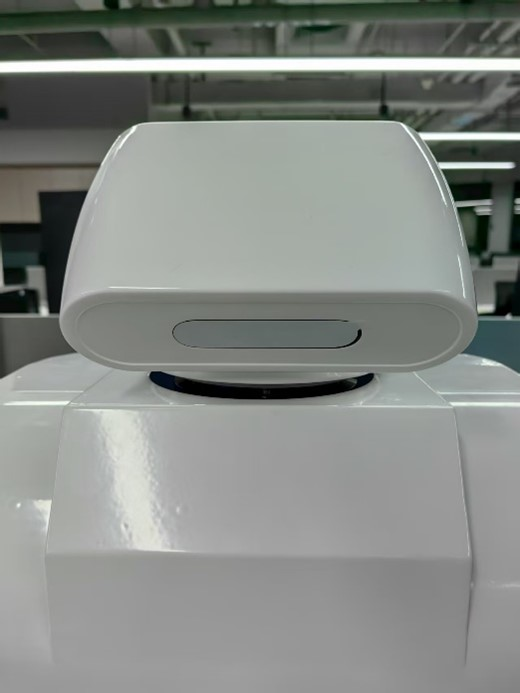
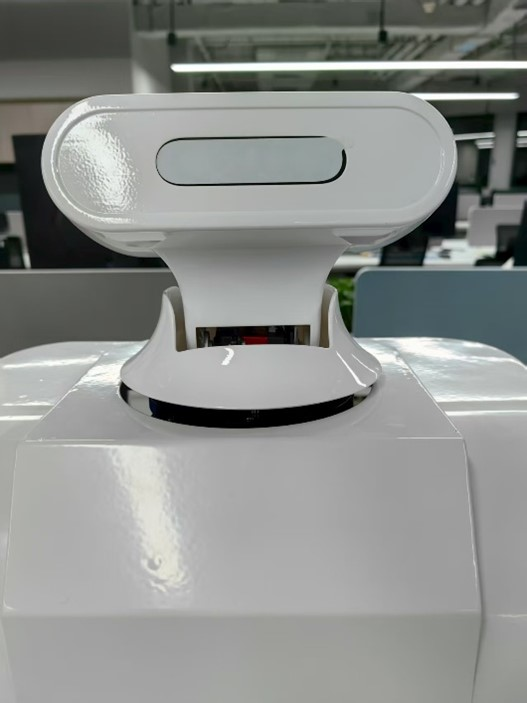
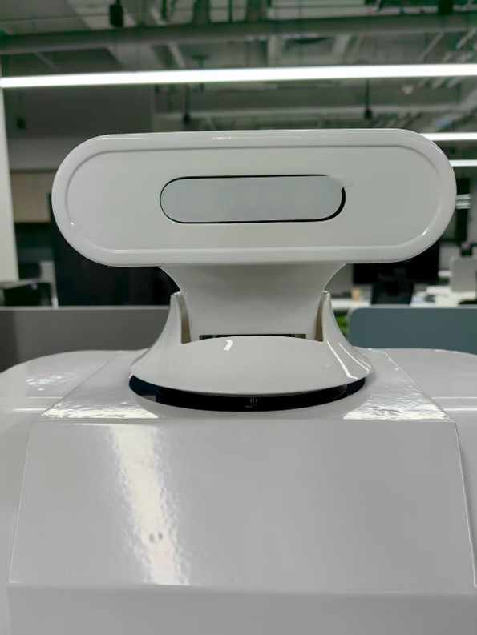

# adora_head_control

Adora机器人头部节点

## 1、**启动ROS节点**

注意：运行ROS节点前需要按照标定步骤中的”**机器人头部位置标定**”,对以下4个参数进行标定，头部电机俯仰通道的（最小值-俯视极限位置、最大值-仰视极限位置、中位值-水平视角值进行标定）、旋转通道的中位值-水平向前看时旋转电机输出的数值。

修改**adora_head_control/adora_head_control**文件夹中的 **adora_head_node.py** 文件，设置 “**PITCH_MIN_VALUE**”、“**PITCH_MAX_VALUE**”、 “**PITCH_MID_VALUE**”、“**YAW_MID_VALUE**”四个参数。

| 参数名称        | 含义                                      |
| --------------- | ----------------------------------------- |
| PITCH_MIN_VALUE | 俯仰轴最小值 - 俯视极限位置下俯仰电机读数 |
| PITCH_MAX_VALUE | 俯仰轴最大值 - 仰视极限位置下俯仰电机读数 |
| PITCH_MID_VALUE | 俯仰轴中位值 - 水平视角位置下俯仰电机读数 |
| YAW_MID_VALUE   | 偏航轴中位值 - 水平视角位置下旋转电机读数 |

对**adora_head_node.py** 文件中四个参数默认值进行修改。



 

修改完成以后重新编译节点，并启动

```shell
colcon  build  
sudo  chmod 777 /dev/ttyUSB0  
ros2  run adora_head_control controller   
```

节点正常启动以后会输出电机反馈的角度位置



该节点接收话题**“adora_robot/head/servo_cmd**”数据，并通过话题 “**adora_robot/head/head_state**” 发布舵机角度和状态。

 

**step2： 新建一个终端对话题发布数据。** 

```
ros2 topic pub -r 1 adora_robot/head/servo_cmd  std_msgs/msg/Float32MultiArray "data: [-1, 3.0]"  
```

该命令表示以1Hz的频率向话题“adora_robot/head/servo_cmd”发布数据，第一个通道数据为 -1弧度，第二个通道数据为 3.0弧度。

**注意：**

l 第一个数据表示俯仰通道的角度（弧度为单位），中位值所在位置为0度，头部向下偏移（俯视）为负，向上偏移（仰视）为正。

l 第二个数据表示旋转轴模板角度（弧度为单位），中位值所在位置为0度，逆时针旋转为正（向左看），顺时针旋转为负（向右看）


## 2、头部电机出厂标定

**用户不需要操作这个步骤，由厂家技术人员标定。**

**1、设置舵机ID**

舵机出厂时默认ID为1，在机器人头部单元中使用了两个舵机，首先需要对其进行ID设置，设置水平旋转轴位置上的舵机ID=2，俯仰方向的舵机ID=1。具体设置方法如下：

**Step1**：将所有舵机串联并与舵机控制板相连，随后启动脚本“set_all_id.py”，设置所有舵机ID=1。

```
python set_all_id.py 1  
```

**Step2**: 断开头部俯仰轴上的舵机连线，只保留旋转方向舵机与舵机驱动板的连接，随后启动脚本“set_all_id.py”，设置水平旋转舵机ID=2.

```
python set_all_id.py 2  
```

 

**2、标定机器人头部位置**

随后启动脚本 “show_all_motor_position.py” 

```
python show_all_motor_position.py 
```

 终端会打印水平旋转和俯仰轴舵机的数值，记录如下信息：



1、将俯仰方向舵机（ID=1）手动掰到最下（头朝下的极限位置），记录舵机输出**最大值**。



 

2、将俯仰方向舵机（ID=1）手动掰到最上（头朝上的极限位置），记录舵机输出**最小值**。



3、记录水平旋转轴舵机头朝前的位置，（水平中、俯仰的中位）。记录ID1和ID2舵机数值记录为中位值。  



 

## 机器人头部位置标定

